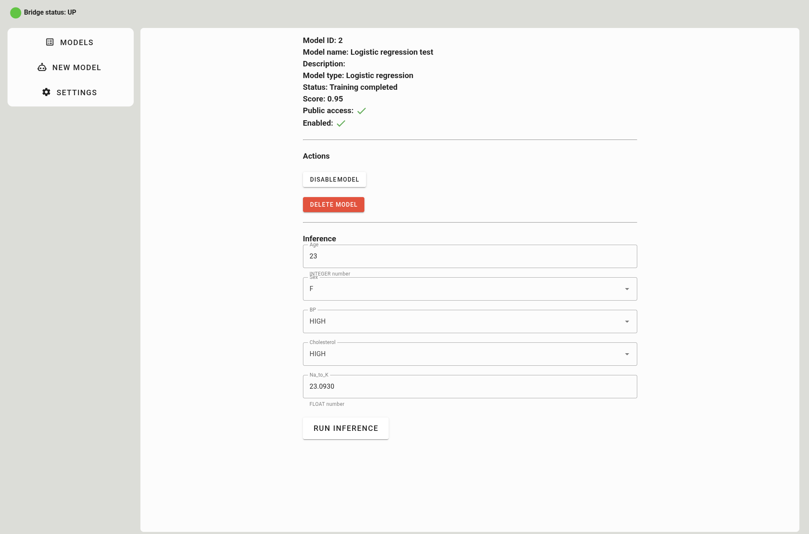

# TruPS

<p align="center" width="100%">
    
</p>

## About
TruPS is a cloud service providing cloud machine learning functionalities.

Machine learning model training and encrypted inference are supported, with encrypted inference being achieved through fully homomorphic encryption
based on TFHE by leveraging Zama ConcreteML library.

By using TruPS users can seamlessly train machine learning models in plaintext and have them be available for private encrypted inference.

There are four supported machine learning models:
- Linear regression
- Logistic regression
- Decision tree regressor
- Decision tree classifier

Fully homomorphic encryption is still fairly unknown and through this cloud service we aim to provide a somewhat easy way to try out fully homomorphic encryption in combination with machine learning.

To read more about the TruPS project visit the [official project website](https://trups.eu)

To view the diagrams of processes within TruPS check out these [diagrams](./processes.md)

## Getting started: Steps 1 and 2 need to be completed only once - when you use TruPS for the first time. For subsequent use, you will only need to perform Step 3.

### 1. Obtaining an API key.

TruPS is a web application available at [trups.app](https://trups.app).
The prerequisite for interacting with TruPS is obtaining an API key. Please contact us at info@randomred.eu to get your API key.
You will need it in ["3. Start working with TruPS"](#3-start-working-with-trups).

&nbsp;

### 2. Installing TruPS bridge

While TruPS is a web application it does require a software called TruPS bridge to be running on user machine.

TruPS bridge is a software that is required to interact with the TruPS web application, and it is a client side piece of software.

The web application (frontend) communicates with the bridge software over HTTP, bridge software runs a web server on port `8282`.

TruPS bridge is available as an executable (Linux only) and as a Docker image.

| OS      | Docker              | Executable          |
|---------|---------------------|---------------------|
| Linux   | :white_check_mark:  | :white_check_mark:  |
| Windows | :white_check_mark:  | :x:                 |
| MacOS   | :white_check_mark:  | :x:                 |

While Linux users can run the executable it is **strongly** recommended to run a Docker container instead.

To download the client side software visit the [releases](https://github.com/RandomRedLtd/trups-public/releases/tag/v1.0.0) page in this repository.

&nbsp;

#### 2.1 Using Docker image - mandatory for Windows and Mac users, recommended for Linux users

2.1.1 Download Docker image: [Download Docker image](https://github.com/RandomRedLtd/trups-public/releases/download/v1.0.0/trups-bridge-image.tar.gz)

To make it easier to find the Docker image in later steps, we recommend creating a 'trups' directory on the C drive and saving or moving the Docker image to C:\trups.

2.1.2 Install Docker, e.g. Docker Desktop (If not already installed on your machine).
More information about the installation: [Installing Docker](installing_docker.md)

2.1.3 After downloading the Docker image, it must be imported.

*Detailed instructions:* [Using Docker](using_docker.md)

*Short instructions for more proficient users:* After downloading the Docker image, it must be imported, to do that run the `load` command:
- for Git Bash shell
```
docker load < trups-bridge-image.tar.gz
```
- for Windows Powershell
```
docker load -i trups-bridge-image.tar.gz 
```

If the Docker load has been successful you may now create the container and run the bridge software with port `8282` exposed:
```
docker run -p 8282:8282 trups-bridge
```

&nbsp;

#### 2.2 Using executable  - for Linux users only (but not recommendable)

2.2.1 Download executable:
[Download executable](https://github.com/RandomRedLtd/trups-public/releases/download/v1.0.0/trups-bridge.tar.gz)

2.2.2 After downloading the executable, extract it and make sure you have execute permission:
```
tar xzf ./trups-bridge.tar.gz

chmod +x ./trups-bridge
```

Make sure port `8282` is free and run the executable:
```
./trups-bridge
```

&nbsp;

## 3. Start working with TruPS

[Go to 3.1 Setup](#31-setup)

[Go to 3.2 User Interface](#32-user-interface)

[Go to 3.3 Creating a New Model](#33-creating-a-new-model)

<br><br>


### 3.1 Setup

When first opening TruPS web application (open [TruPS.app](https://trups.app/) webpage in your web browser) you will see a screen to enter your API key ([See "Obtaining an API key"](#1-obtaining-an-api-key)). To start working with TruPS, enter your API key and click `SET API KEY`.

<p align="center" width="100%">
    
</p>

If you see this screen instead:

<p align="center" width="100%">
    
</p>

This means that the TruPS bridge software is not running, make sure it is running to continue. Just open Docker Desktop application, go to `Containers` in the left menu, click on the `Start` button and after that re-open the browser tab and go again to [TruPS.app](https://trups.app/) webpage.

<p align="center" width="100%">
    
</p>

If this does not help ([Go to "Installing TruPS bridge"](#2-installing-trups-bridge)).

### 3.2 User interface

There are 3 menu items in the user interface: `Models`, `New Model`, and `Settings`.

The homepage is the table of all created models. Here you can see the models and some of their info, like name, model type, and are they available for inference. The silhouette on the left marks all models that you have created and which, consequently, you can use for inference. Other users created all other models and you can use them if they are public (`true` in `Public access` column). You can contact info@randomred.eu if you want to know more details about them.

<p align="center" width="100%">
    
</p>

To see the details of a model click on the model and the model detail page will appear. *Remark: some options, such as `DELETE MODEL` or `DISABLE MODEL`, may not be visible depending on the ownership of the model and your level of access.*

<p align="center" width="100%">
    
</p>

If inference is enabled, you can then run inference on this model by filling out all of the required fields and clicking `RUN INFERENCE`.

**Here, you can witness the main feature of TruPS: for inference you are using a model, deployed and running in the cloud, that DOES NOT know your plaintext value - in other words, here TruPS performs inference on encrypted data.**

*Remark: if you created a model that was not public, in the same interface you will see options in which you can grant access to this model to other user(s) by writing their Used ID (numerical value).*

During the current testing phase, the time for inference is limited to 10 minutes. If inference takes longer, you will receive the error: *Inference output: Inference unsuccessful, status code: 504.* In that case, try (re)training/creating your model with fewer features (columns) and/or use a simpler model type ([Go to "Creating a new model"](#Creating-a-new-model)). Reducing the number of samples (rows) should not have a significant impact, but you can experiment with it as well.

<p align="center" width="100%">
    
</p>

Finally, if the inference was successful, the result will be displayed:

<p align="center" width="100%">
    
</p>

### 3.3 Creating a new model

In general, due to the 60-second inference time limitation during this testing phase, we recommend using datasets with a maximum of 5 features (columns) and 1,000 samples (rows) when creating your models. Sample datasets are available to help you get started.

In [sample datasets](./sample-datasets) you will find `salary.csv` and `drug200.csv` sample datasets, and 'readme-datasets.md' if you want to know more about those datasets.

You can download these datasets and create new models with those datasets.

Model type is important: `salary.csv` is intended for a classifier model like **Linear Regression** while `drug200.csv` is intended for a prediction model like **Logistic Regression**.

To create a new model click on `NEW MODEL` in the siderbar, and this page will pop up:

<p align="center" width="100%">
    
</p>

Here, fill out the required fields: Model name, Model description and Model type.

By default, all created models are `public`, i.e. available to all users of TruPS (you can disable this option and, in that case, you can give access to other users when you click on your created model in `MODELS` interface, as explained above).

For the data, upload a CSV file containing your train data, **for the target (y) field, your column should be called `Target`, case sensitive**.

Once the CSV has been loaded (use `salary.csv` as an example, Model type **Linear Regression**), a dynamic form for your inputs will be displayed. In this case we have dataset with only one feature (independent variable `YearsExperience`).

<p align="center" width="100%">
    
</p>

You should fill out the input types for your model.

Possible input types are: `INTEGER`, `FLOAT`, and `ENUMERATION`.

Another example of a new model with more features (independent variables) represented by different input types  (use `drug200.csv` as an example, Model type **Logistic Regression**):

<p align="center" width="100%">
    
</p>

And with input types filled out:

<p align="center" width="100%">
    
</p>

After creating a model, it gets in a queue for training, and until the training is successful it is unavailable for inference:

<p align="center" width="100%">
    
</p>

If the training was successful it'll be available for inference:

<p align="center" width="100%">
    
</p>

And the result of this classifier model:

<p align="center" width="100%">
    
</p>

### 3.4 Settings

If, for some reason the application starts misbehaving or outright not working, you can try to reset your bridge by navigating to `SETTINGS` and then clicking on the `Clean` button:

<p align="center" width="100%">
    
</p>

This will wipe all your local bridge data, including models and keys, **make sure you have your API saved because you will have to input it again**.

Model data can be restored from the server, while the keys cannot as they are saved on your machine.

The loss of keys isn't really an issue since encrypted inference results are not saved anywhere, so you can continue performing inference even afer cleaning, provided you enter your API key.

## Third-Party Components
This project includes components from the following third-party libraries:
**ConcreteML**: Licensed under the BSD-3-Clause-Clear license.
See [ConcreteML readme](https://github.com/zama-ai/concrete-ml?tab=License-1-ov-file#readme) for details.
