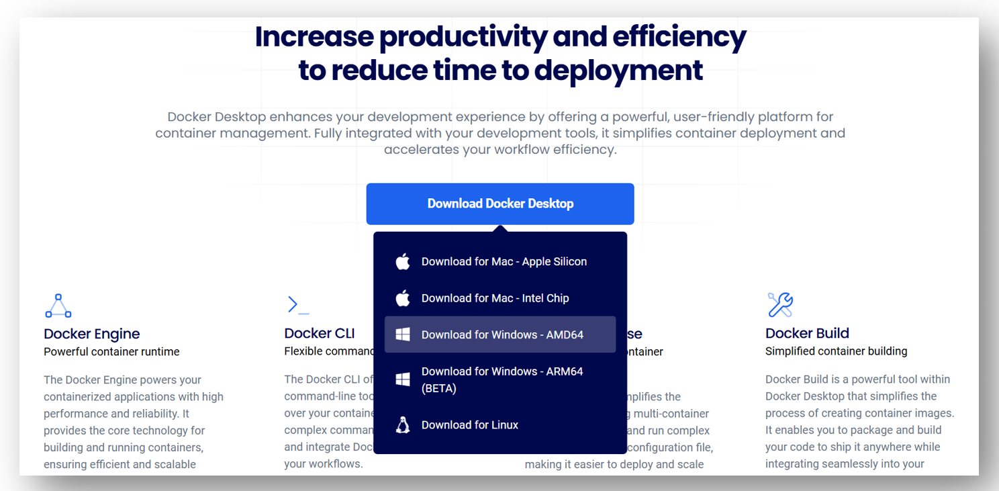
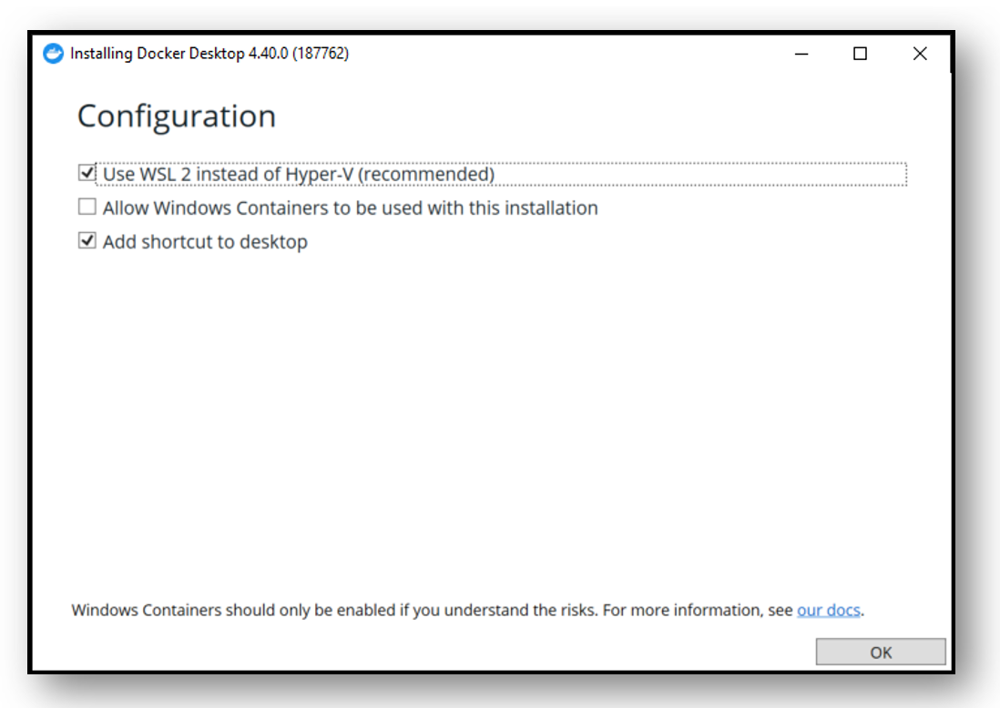
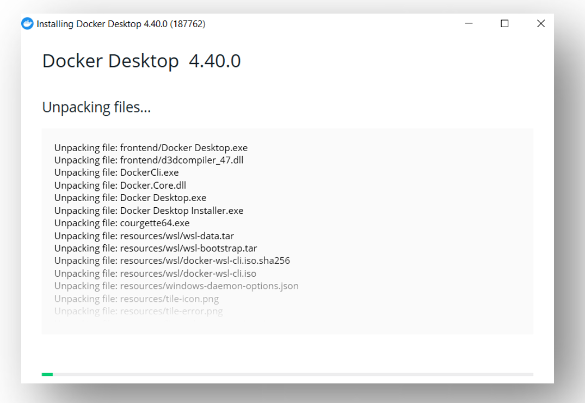
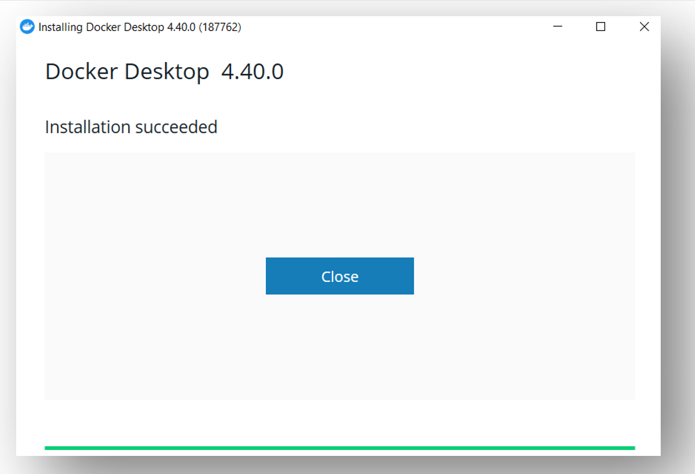

# Installing Docker

- Go to link: [https://www.docker.com/products/docker-desktop/](https://www.docker.com/products/docker-desktop/)

- Scroll down, find "Download Docker Desktop" button, choose and download appropriate version, e.g. Download for Windows - AMD64

    

- Start installing Docker. Thereby, freely decide if you want to have shortcut on desktop, click OK and wait for few minutes until install ends:

    

    

    

