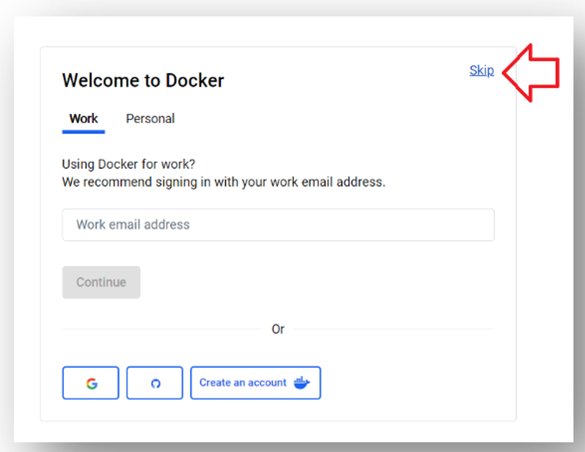
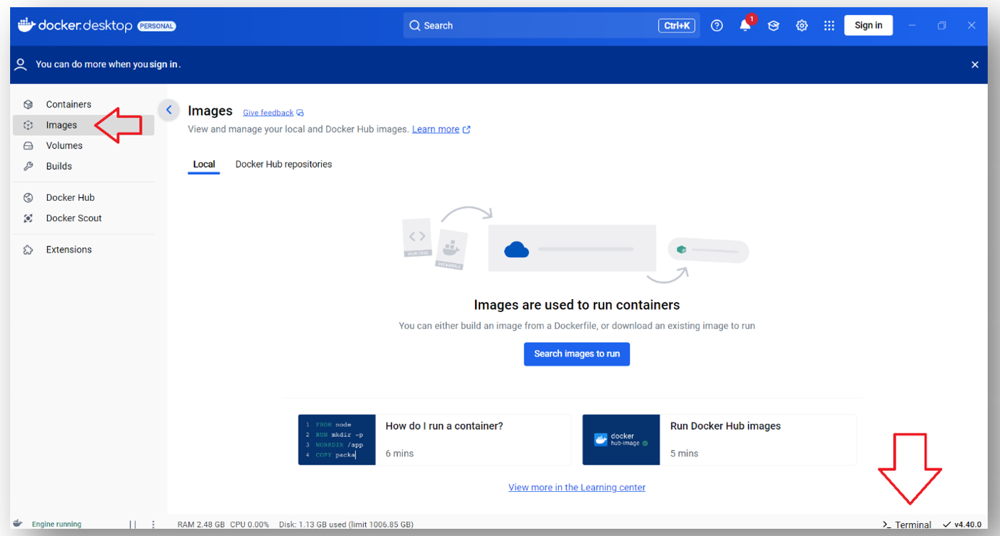
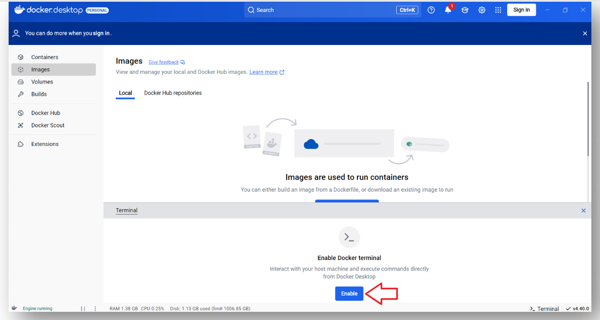
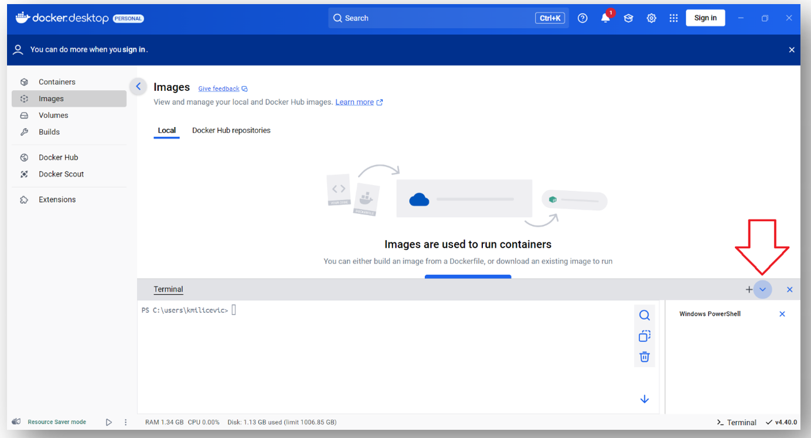
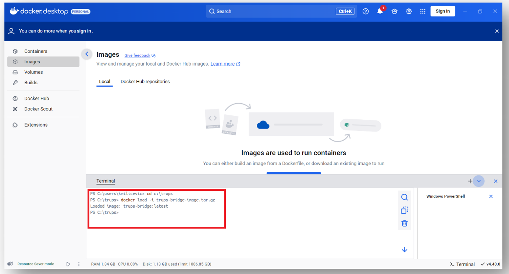
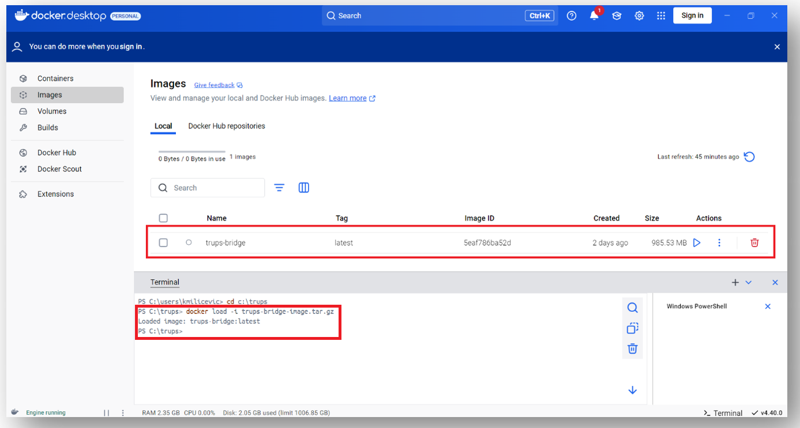
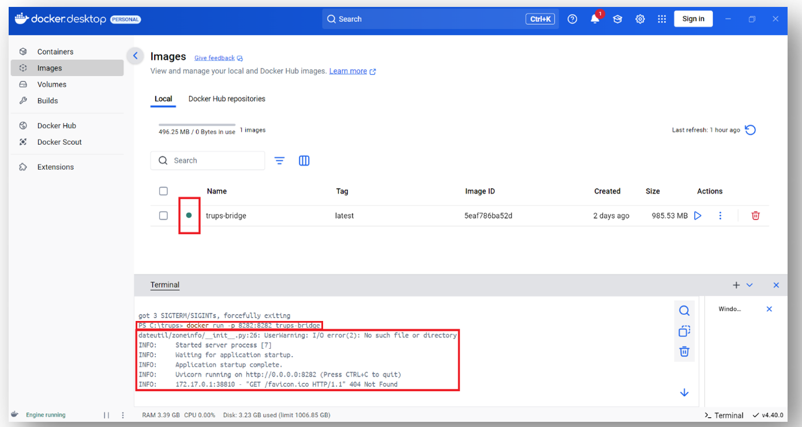

# Using Docker:

- start Docker Desktop (e.g. by clicking on desktop icon), accept the terms, feel freely to skip the signing in procedure and the welcome survey (in both windows click „Skip“ in upper right corner)

<p align="center">
  
</p>

<p align="center">
  
</p>


- click on „Images“ and then on „Terminal“:

<p align="center">
  
</p>

- click on Enable:

<p align="center">
  
</p>

- click on arrow will offer you different shells (experienced users can choose freely; e.g. for less experienced Windows users we recommend Windows Powershell):

<p align="center">
  
</p>


- in terminal you will see your user directory as the starting one (in this example C:\Users\kmilicevic).

Navigate to the directory where you have saved Docker image (see step 2.1.1 in [README](README.md)).

For example, if you saved Docker image to 'C:\trups', just type in terminal:
```
cd C:\trups
```

<p align="center">
  
</p>


- type in command (if you have chosen Windows Powershell, as recommended above):
```
docker load -i trups-bridge-image.tar.gz 
```
Remark: If you have chosen e.g. Git Bash instead of Windows Powershell, type in command:
```
docker load < trups-bridge-image.tar.gz
```

- if load was successful, loaded image should appear in window:

<p align="center">
  
</p>


- type in the command to run the image (valid for Windows Powershell and Git Bash):
```
docker run -p 8282:8282 trups-bridge 
```
- if successful, you will notice a green indicator and corresponding log in terminal:

<p align="center">
  
</p>
